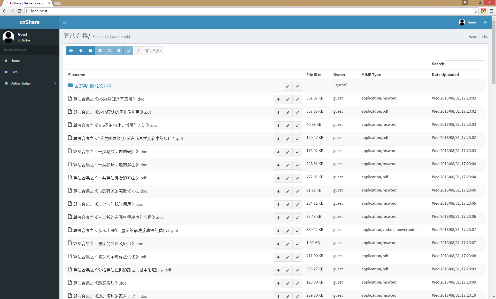
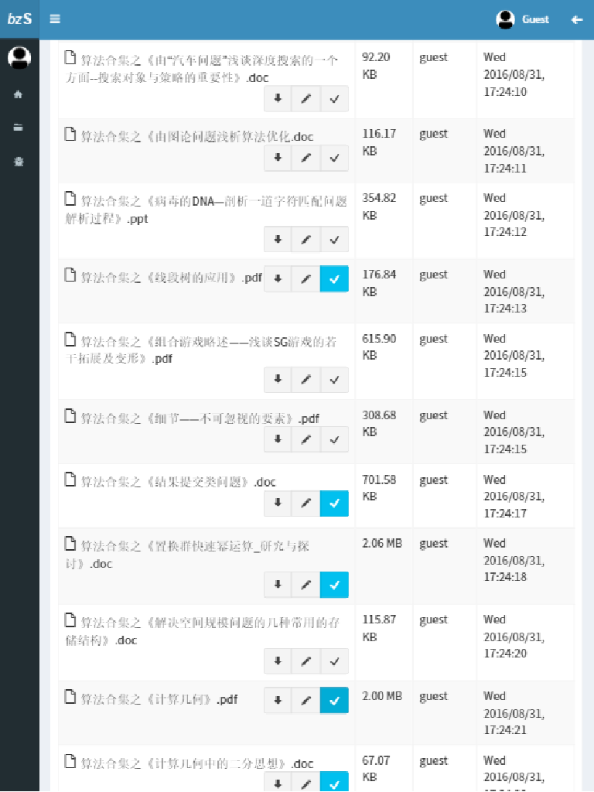
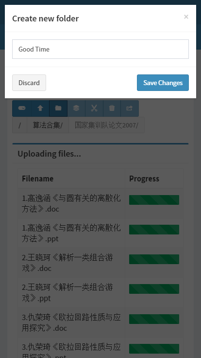

# bzShare

bzShare is a project hosted on [Github](https://github.com/ht35268/bzShare). It
is inspired by [@xmcp](https://github.com/xmcp)'s [EZShare](https://github.com/xmcp/EZShare)
and initiated by [@ht35268](https://github.com/ht35268).

bzShare is a web server created with HTML5 and is a responsive design made to
work on all devices, including computers, tablets and mobile phones. You can
access your OI materials anywhere, anytime.

## Functionalities

 - Sharing files with explicit ownership
 - <del>Chat with your friends or in groups</del>
 - <del>Announce your daily events on the timeline</del>
 - <del>Discuss and solve problems on forums</del>
 - <del>Train your coding skills on the online judge</del>

## Screenshots

Works great on **all devices!**

Computer, 1920x1080 FHD

Tablet, iPad 2, 768x1024

Smartphone, iPhone 6S, 414x736

All screenshots were taken on a Google Chrome.

# Todo List

  - [ ] Implement a working user management module with permission management limiting file and folder access from users.
  - [ ] Improve sparsed file performance by implementing element re-use methods, thereby improving deletion speed. Copy and moving speed are virtually neglectible. Saving another array to store those nodes which have been removed can be very useful, therefore filling up the blanks.
  - [ ] Use an asynchronous model for filesystem management, returning progress to the web client whenever called. Progress bars should be implemented in the user interface.
  - [ ] Multithread the SQLFS manager in order to make it asynchronously link with the web server.

# Special Thanks

| User                                         | Accolade                                                                              |
| :------------------------------------------- | :------------------------------------------------------------------------------------ |
| [Almsaeed Studio](http://almsaeedstudio.com) | Providing a nice responsive HTML5 administrative template.                            |
| [Facebook](https://www.facebook.com)         | Designing and maintaining the high performance asynchronous web server `Tornado`.     |
| [Heroku](https://www.heroku.com)             | Providing a user-friendly SaaS platform for users.                                    |
| [@xmcp](https://github.com/xmcp)             | Giving critical advices and pointing crucial issues that affect the overall security. |
