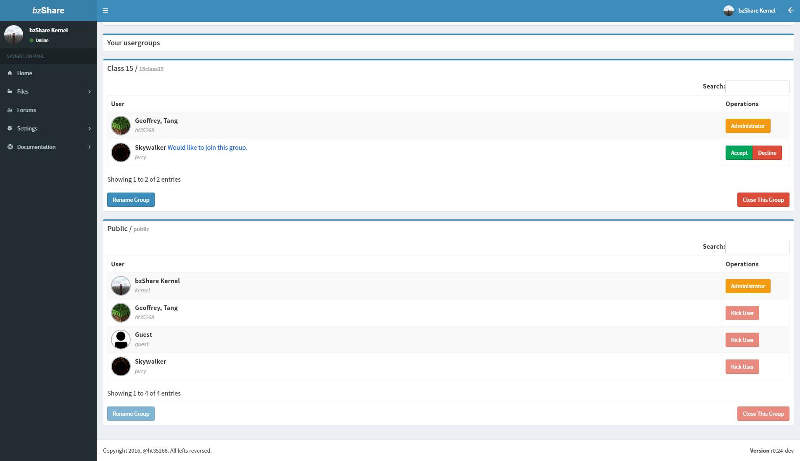
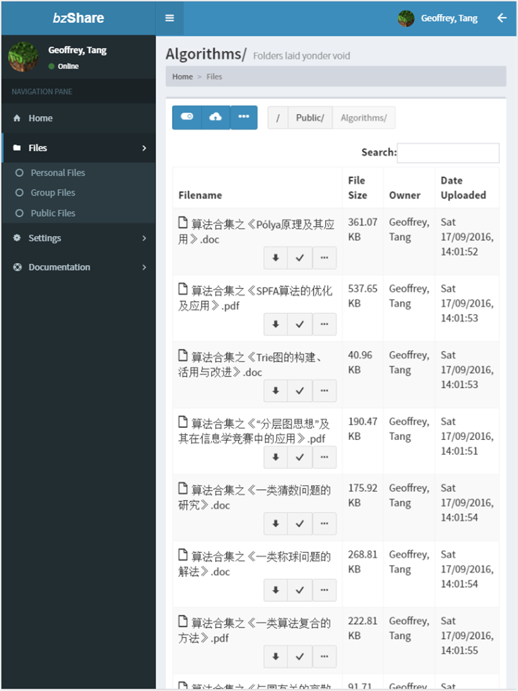
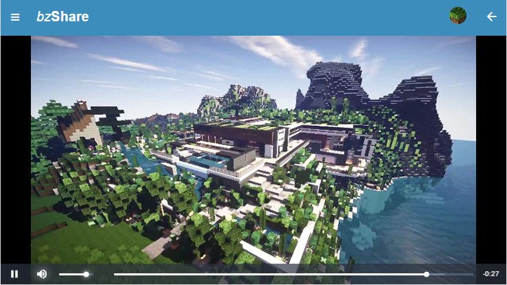
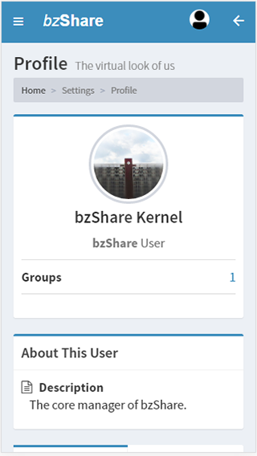

# bzShare

bzShare is a project hosted on [Github](https://github.com/ht35268/bzShare). It
is inspired by [@xmcp](https://github.com/xmcp)'s [EZShare](https://github.com/xmcp/EZShare)
and initiated by [@ht35268](https://github.com/ht35268).

bzShare is a web server created with HTML5 and is a responsive design made to
work on all devices, including computers, tablets and mobile phones. You can
access your OI materials anywhere, anytime.

## Functionalities

 - Sharing files with explicit ownership
 - <del>Discuss and solve problems on forums</del>

## Screenshots

Works great on **all devices!**

Computer, 1920x1080 FHD (Usergroups)

Tablet, iPad 2, 768x1024 (File manager)

Smartphone, iPhone 6S, 736x414 (Video Preview)

Small smartphone, iPhone 5, 320x568 (Profile)

All screenshots were taken on a Google Chrome.

# Special Thanks

| User                                         | Accolade                                                                              |
| :------------------------------------------- | :------------------------------------------------------------------------------------ |
| [Almsaeed Studio](http://almsaeedstudio.com) | Providing a nice responsive HTML5 administrative template.                            |
| [Facebook](https://www.facebook.com)         | Designing and maintaining the high performance asynchronous web server `Tornado`.     |
| [Heroku](https://www.heroku.com)             | Providing a user-friendly SaaS platform for users.                                    |
| [@xmcp](https://github.com/xmcp)             | Giving critical advices and pointing crucial issues that affect the overall security. |
